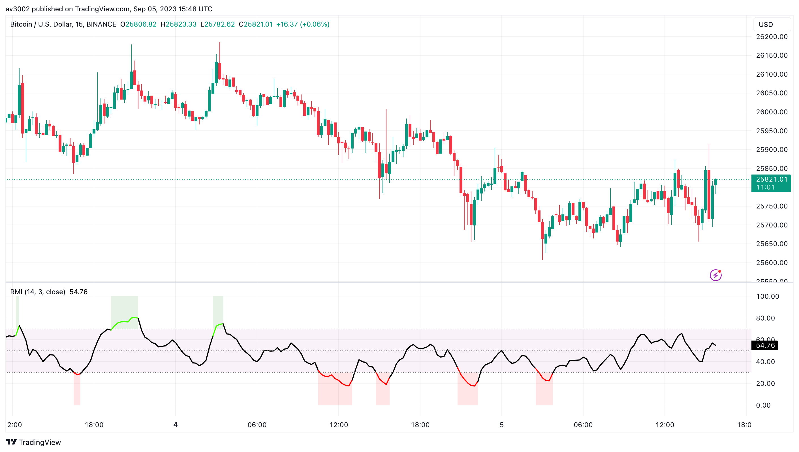
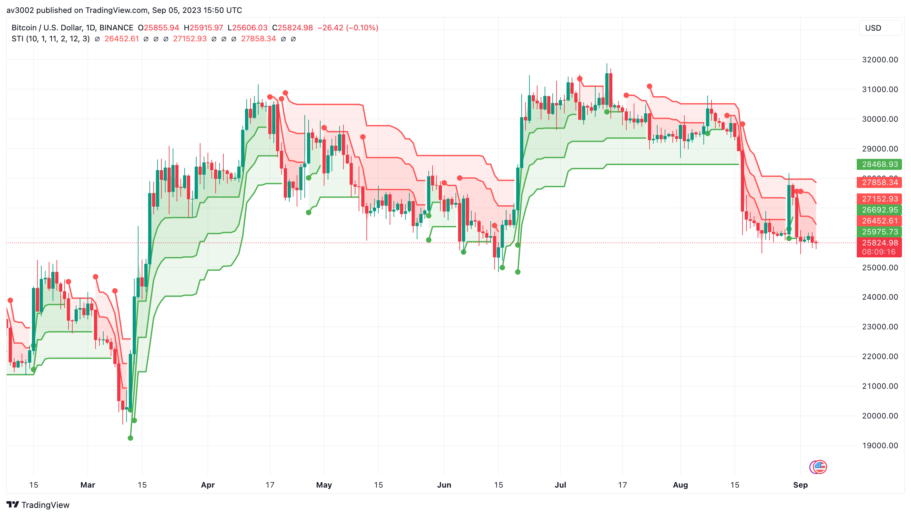
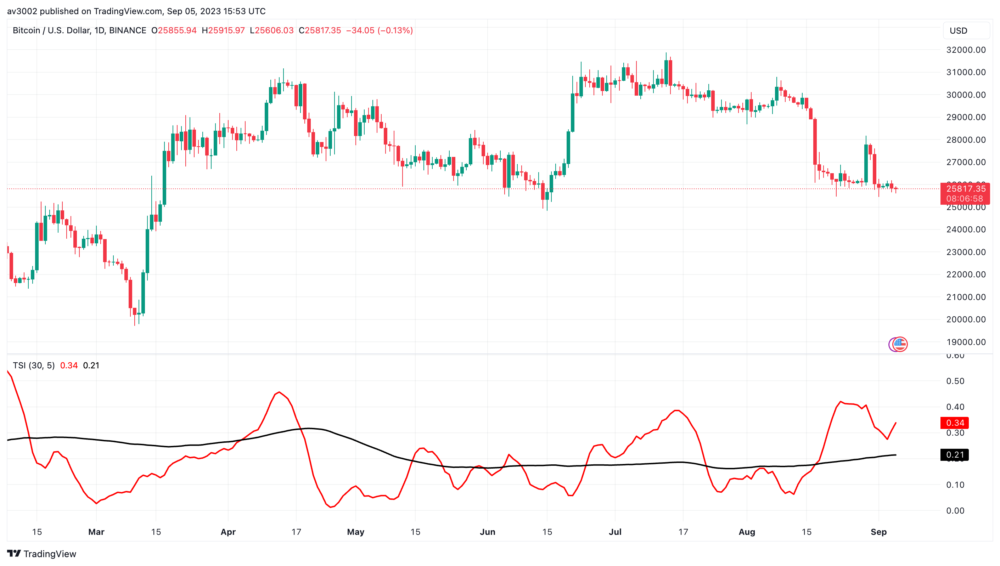

# 📊 Custom Strategy Indicators v1

Welcome to the **Custom Strategy Indicators** repository! In the fast-paced world of stock trading, having the right tools can make all the difference. These technical indicators are designed to provide actionable insights, empowering you to make smarter decisions and optimize your trading strategies.

## Why Use Technical Indicators?

Technical indicators are essential for traders and investors, offering insights derived from historical price and volume data. They help you:

- **Identify Trends**: Recognize bullish or bearish market trends.
- **Gauge Momentum**: Understand the strength of price movements.
- **Set Entry and Exit Points**: Optimize timing for trades.
- **Manage Risk**: Minimize potential losses with informed decision-making.

By integrating these indicators into your trading approach, you can gain a competitive edge in the dynamic financial markets.

## Included Indicators

1. 💹 **Relative Momentum Index (RMI)**
2. 📈 **Adaptive Moving Average (AMA)**
3. 🌀 **Supertrend Indicator**
4. ⛔ **Chandelier Exit**
5. 📊 **Trend Strength Index (TSI)**

## Indicator Descriptions

### 💹 Relative Momentum Index (RMI)

The **Relative Momentum Index (RMI)** is a momentum oscillator combining elements of the Relative Strength Index (RSI) and Rate of Change (ROC). It provides a detailed view of an asset’s momentum, helping traders identify overbought or oversold conditions.

**Use Case**:  
- Overbought: RMI > 70 (potential sell signal).  
- Oversold: RMI < 30 (potential buy signal).

**How to Use**:
- Buy when RMI crosses above 30 with upward momentum.
- Sell when RMI crosses below 70 with downward momentum.

---

### 📈 Adaptive Moving Average (AMA)

The **Adaptive Moving Average (AMA)** adjusts to market conditions by dynamically responding to volatility, offering smoother trend-following signals compared to traditional moving averages.

**Use Case**:  
- Identifies trend direction and adapts to changing conditions.  
- Useful for staying in trades during trends and reacting to volatility.

**How to Use**:
- Buy when the price is above the AMA (uptrend).
- Sell when the price is below the AMA (downtrend).

---

### 🌀 Supertrend Indicator

The **Supertrend Indicator** is a volatility-based tool for identifying market trends and reversals. It helps traders capitalize on price movements effectively.

**Use Case**:  
- Indicates trends: Price above the line = uptrend; price below the line = downtrend.  
- Highlights potential reversal points for trade exits.

**How to Use**:
- Buy when the price is above the Supertrend line.
- Sell when the price is below the Supertrend line.
- Use reversal points for potential trade exits or reversals.

---

### ⛔ Chandelier Exit

The **Chandelier Exit** is a volatility-based stop-loss indicator. It adjusts based on market volatility, helping traders protect positions from adverse price swings.

**Use Case**:  
- Dynamically sets stop-loss levels based on volatility.  
- Widens during high volatility to provide a buffer.

**How to Use**:
- Set stop-loss at the Chandelier Exit value.
- Adjust as volatility changes.
- Protect positions from sudden price drops.

---

### 📊 Trend Strength Index (TSI)

The **Trend Strength Index (TSI)** measures trend strength by analyzing the interaction of price and volume. It provides insights into trend momentum and potential reversals.

**Use Case**:  
- Rising TSI = strong trend.  
- Declining TSI = weakening trend or potential reversal.

**How to Use**:
- Buy during a rising TSI indicating a strong uptrend.
- Be cautious or sell during a declining TSI signaling weakness.

---

## How to Use These Indicators

1. **Import**: Add the indicator files to your trading platform (e.g., TradingView).  
2. **Apply**: Use them on your price charts.  
3. **Customize**: Adjust settings to suit your trading style.  
4. **Analyze**: Interpret signals to make informed decisions.  
5. **Learn**: Refer to the included code and documentation for advanced customization.

Enhance your trading strategies with these powerful indicators and gain the confidence to navigate the stock market like a pro. Happy trading! 🚀💰📉
