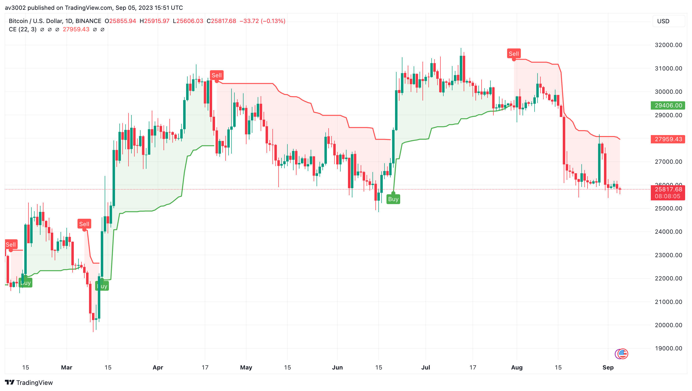

# 📊 Custom Strategy Indicators

Welcome to the Custom Strategy Indicators repository! In the world of stock market trading, having the right tools is crucial for success. These technical indicators are designed to provide you with valuable insights, helping you make informed decisions and enhance your trading strategies.

## Why Technical Indicators Matter

Technical indicators play a pivotal role in stock market trading by providing traders and investors with essential data-driven insights. These indicators help you identify trends, gauge market momentum, set optimal entry and exit points, and manage risk effectively. By incorporating these indicators into your trading strategy, you gain a competitive edge in navigating the dynamic and often unpredictable world of financial markets.

## Included Indicators

1. 💹 Relative Momentum Index (RMI)
2. 📈 Adaptive Moving Average (AMA)
3. 🌀 Supertrend Indicator
4. ⛔ Chandelier Exit
5. 📊 Trend Strength Index (TSI)

## Indicator Descriptions

### Relative Momentum Index (RMI)

The Relative Momentum Index (RMI) is a custom momentum oscillator that combines elements of the Relative Strength Index (RSI) and Rate of Change (ROC). It offers a comprehensive view of an asset's momentum, helping traders make decisions based on its relative strength compared to historical data.

**Use Case:** 
RMI is used to identify overbought and oversold conditions in the market. When RMI crosses above 70, it suggests that the asset may be overbought, indicating a potential sell signal. Conversely, when RMI crosses below 30, it suggests that the asset may be oversold, indicating a potential buy signal.

**How to Use:**
- Buy when RMI crosses above 30 and shows upward momentum.
- Sell when RMI crosses below 70 and shows downward momentum.

### Adaptive Moving Average (AMA)

The Adaptive Moving Average (AMA) adjusts the sensitivity of the moving average to market conditions. Unlike traditional moving averages, the AMA responds dynamically to changes in volatility, offering a smoother and more adaptive trend-following indicator.

**Use Case:**
AMA is used to identify the direction of the trend and adapt to changing market conditions. In trending markets, it helps traders stay in trades longer, and in volatile markets, it responds quickly to price changes.

**How to Use:**
- Buy when the price is above the AMA, indicating an uptrend.
- Sell when the price is below the AMA, indicating a downtrend.

### Supertrend Indicator

The Supertrend Indicator is a custom trend-following tool that leverages price volatility. It provides clear signals for identifying trends and potential reversal points in the market, allowing traders to capitalize on price movements effectively.

**Use Case:**
Supertrend helps traders identify trends and potential entry or exit points. When the price is above the Supertrend line, it indicates an uptrend, and when below, it indicates a downtrend. Reversal points can be used for potential trade exits or reversals.

**How to Use:**
- Buy when the price is above the Supertrend line.
- Sell when the price is below the Supertrend line.
- Use Supertrend reversal points for trade exits or reversals.

### Chandelier Exit

Chandelier Exit is a volatility-based indicator that assists in determining stop-loss levels. By factoring in market volatility, it helps traders set appropriate stop-loss levels, ensuring protection against sudden and adverse price swings.

**Use Case:**
Chandelier Exit helps traders manage risk by setting stop-loss levels that adapt to market volatility. When prices become more volatile, the Chandelier Exit widens, providing a buffer against sudden price movements.

**How to Use:**
- Set your initial stop-loss at the Chandelier Exit value.
- Adjust the Chandelier Exit value based on market volatility.
- Use it to protect your positions from large price swings.

### Trend Strength Index (TSI)

The Trend Strength Index (TSI) measures trend strength by analyzing the interaction between price and volume. It offers a comprehensive view of a trend's strength, enabling traders to make more informed decisions based on both price and volume dynamics.

**Use Case:**
TSI helps traders assess the strength of a trend. Rising TSI values indicate a strong trend, while declining values suggest weakening. It can be used to confirm trends or identify potential reversals.

**How to Use:**
- Buy when TSI is rising and indicates a strong uptrend.
- Sell or be cautious when TSI is declining, as it may signal a weakening trend or potential reversal.

## Usage and Instructions

To incorporate these indicators into your trading strategy, follow these steps:

1. Import the indicator files into your preferred trading platform (e.g., TradingView).

2. Apply the indicators to your price charts.

3. Customize the indicator settings to align with your trading preferences.

4. Analyze the signals generated by each indicator to make informed trading decisions.

5. Explore the code examples and documentation provided in this repository for detailed instructions on customization and usage.

Enhance your trading game with these powerful custom indicators and gain a competitive edge in the stock market. Happy trading! 🚀💰📉
